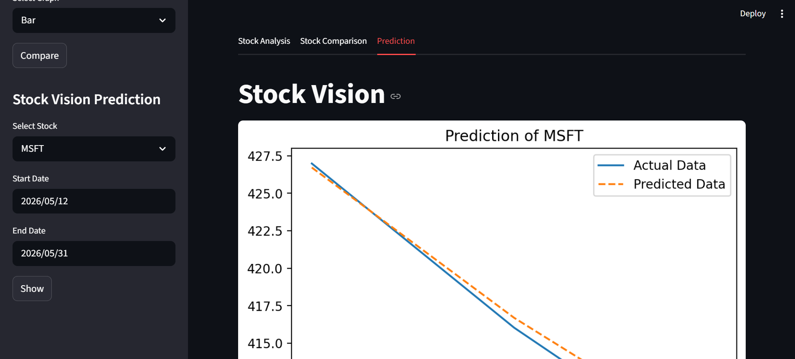
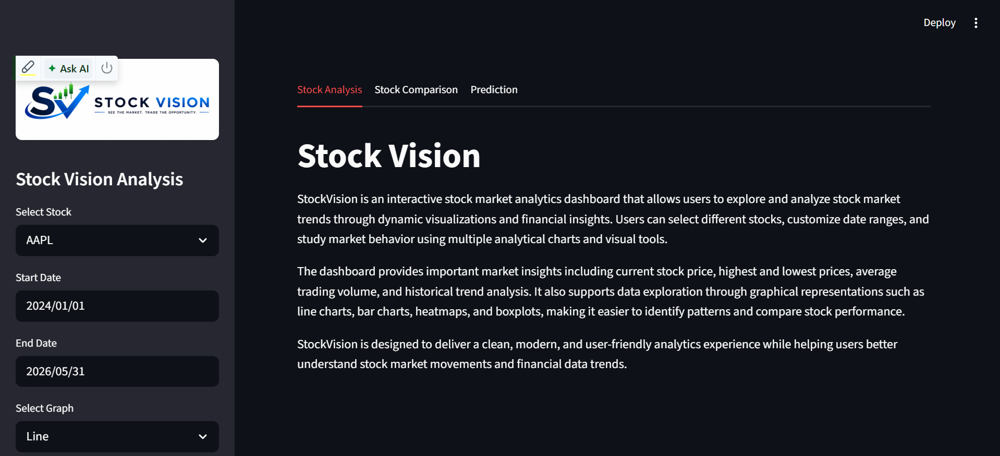
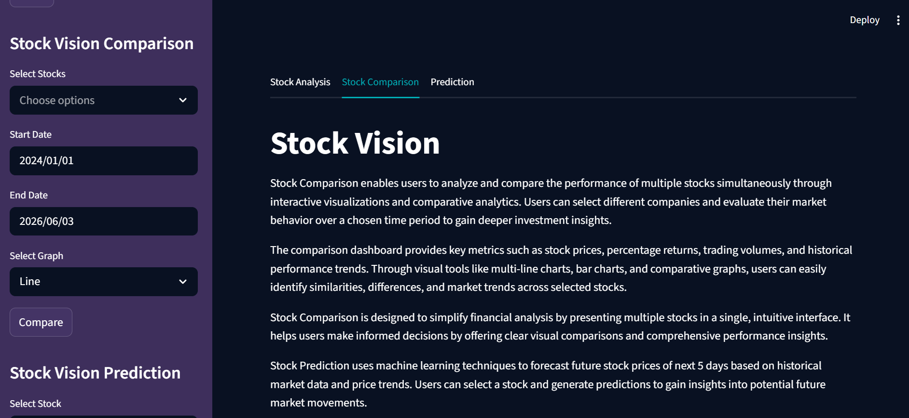
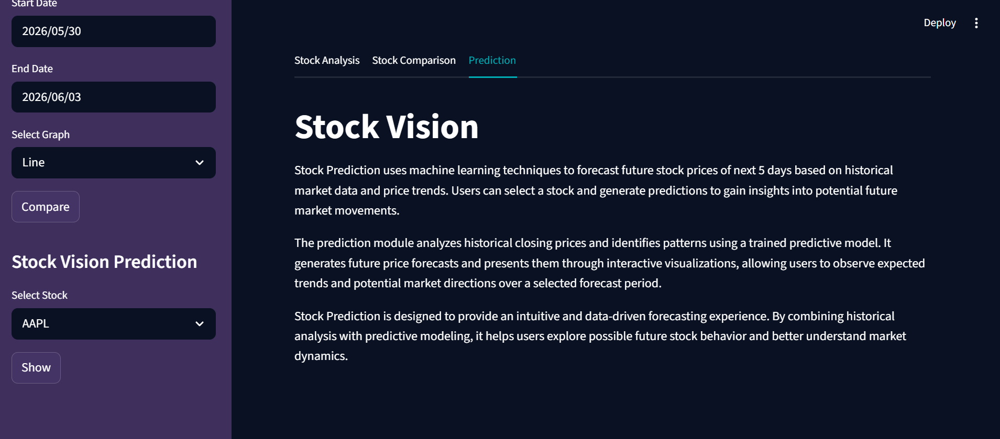
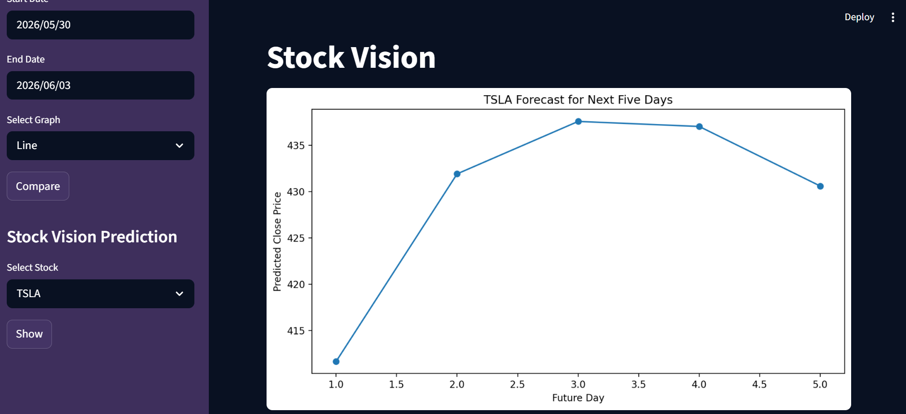

# 📈 StockVision

StockVision is an interactive stock market analytics dashboard built with Streamlit that enables users to explore, compare, and forecast stock market performance through data visualization and machine learning.

The application provides a clean and intuitive interface for analyzing historical stock data, comparing multiple stocks, and generating future (5 days) stock price predictions using predictive modeling techniques.

---

## 🚀 Features

### 📊 Stock Analysis

* Explore historical stock market data.
* Visualize stock performance using interactive charts.
* Analyze key metrics such as:

  * Current Price
  * Highest Price
  * Lowest Price
  * Average Trading Volume
* View market trends through multiple visualizations:

  * Line Charts
  * Bar Charts
  * Heatmaps
  * Boxplots

### 📈 Stock Comparison

* Compare multiple stocks simultaneously.
* Analyze relative performance over custom date ranges.
* Visualize comparative trends and market behavior.
* Identify patterns, similarities, and differences across selected stocks.

### 🤖 Stock Prediction

* Forecast future stock prices using Machine Learning.
* Utilize historical closing prices as predictive features.
* Generate future price forecasts and trend visualizations.
* Explore expected market movements through data-driven predictions.

---

## 🛠️ Technologies Used

* Python
* Streamlit
* Pandas
* NumPy
* Matplotlib
* Seaborn
* Scikit-learn
* yFinance

---

## 📂 Project Structure

```text
StockVision/
│
├── assets/                 # Images and project assets
├── data/                   # Page content and descriptions
├── models/                 # Machine learning models
├── utils/                  # Utility functions
├── .streamlit/             # Streamlit configuration
│
├── app.py                  # Main Streamlit application
├── requirements.txt        # Project dependencies
├── README.md               # Project documentation
└── .gitignore              # Ignored files and folders
```

---

## ⚙️ Installation

### Clone the Repository

```bash
git clone https://github.com/pranshi147/StockVision.git
cd StockVision
```

### Create Virtual Environment

```bash
python -m venv venv
```

### Activate Virtual Environment

#### Windows

```bash
venv\Scripts\activate
```

#### macOS/Linux

```bash
source venv/bin/activate
```

### Install Dependencies

```bash
pip install -r requirements.txt
```

---

## ▶️ Run the Application

```bash
streamlit run app.py
```

The application will open in your browser at:

```text
http://localhost:8501
```

---

## 📊 Machine Learning Approach

The prediction module uses historical stock closing prices to generate future forecasts.

Key steps include:

1. Collect historical stock data using yFinance.
2. Create lag features from previous closing prices.
3. Train a regression model on historical trends.
4. Generate future stock price forecasts.
5. Visualize predicted market movements.

---

## 🎯 Project Objectives

* Simplify stock market analysis through visualization.
* Enable users to compare multiple stocks efficiently.
* Demonstrate practical applications of Machine Learning in finance.
* Provide an accessible and user-friendly analytics dashboard.

---

## 📸 Screenshots


<br>

<br>

<br>

<br>

<br>


---

## 👩‍💻 Author

**Pranshi Mittal**

GitHub: https://github.com/pranshi147

## ⭐ Support

If you found this project useful, consider giving it a star on GitHub.
